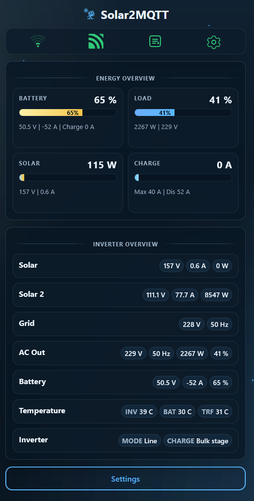
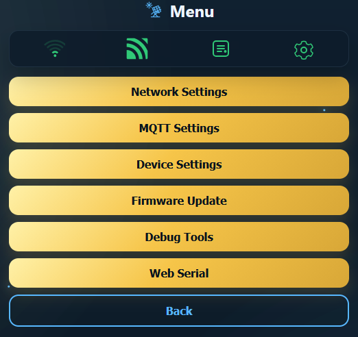
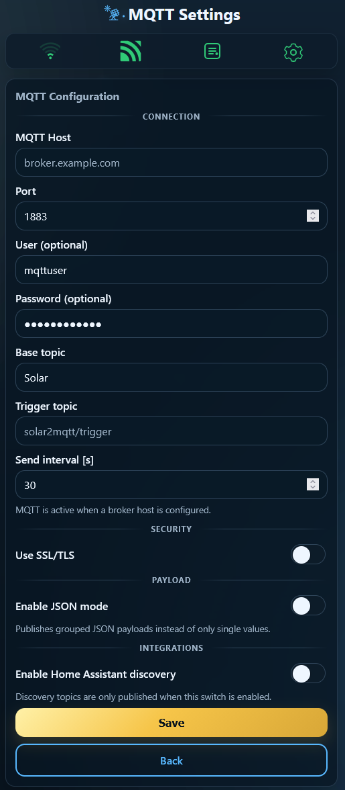
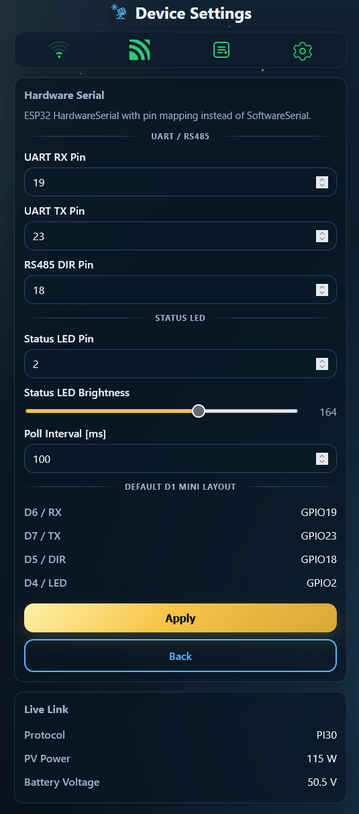
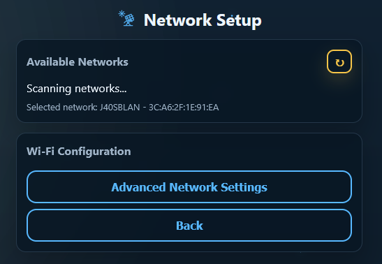
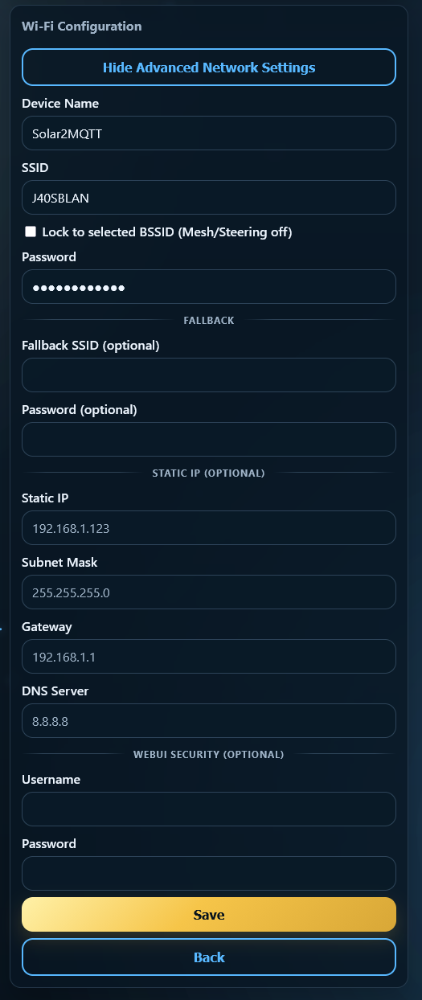
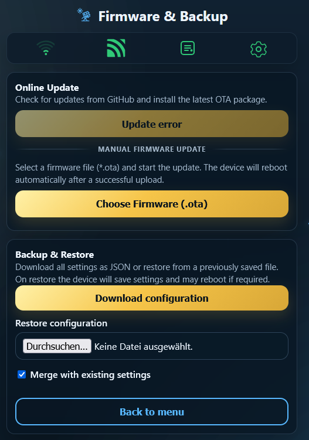
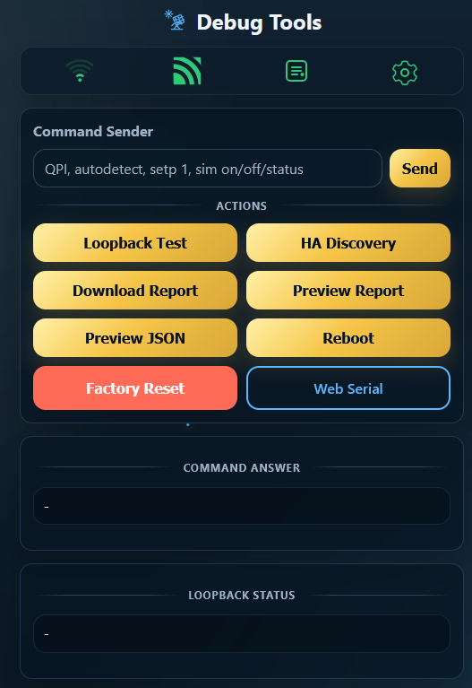

# Solar2MQTT  

# Features:
- Support WiFi or LAN Modules
- captive portal for wifi and MQTT config
- config in webinterface
- Full Controll with [Custom commands](https://github.com/softwarecrash/Solar2MQTT/wiki/Set-parameters)
- get essential data over webinterface, get [all data](https://github.com/softwarecrash/Solar2MQTT/wiki/Datapoints-and-units) over MQTT
- classic MQTT datapoints or Json string over MQTT
- get Json over web at /livejson?
- firmware update over webinterface
- debug log over USB or Webserial
- [blink codes](https://github.com/softwarecrash/Solar2MQTT/wiki/Blink-Codes) for the current state of the ESP
- [Reset functions](https://github.com/softwarecrash/Solar2MQTT/wiki/Reset)
- [Support Home Assistant](https://github.com/softwarecrash/Solar2MQTT/wiki/HomeAssistant-integration)

**works with**
- Most devices that use the watchpower PC Software
-  Most devices that use the Solarpower PC Software
- PIP devices
- i solar 
- IGrid
- Many devices from EASUN
- and many many others based on the chinese solar inverter with a rj45 jack and usb port, primary identified by the display
- Take a look at the [device list in the wiki](https://github.com/softwarecrash/Solar2MQTT/wiki/Confirmed-Working-Device-List)

**Main screen:**

**Menu:**

**Config:**

# How to use:
- flash your ESP32 (recommended Wemos D1 Mini ESP32) with our [Flash2MQTT-Tool](https://all-solutions.github.io/Flash2MQTT/?get=Solar2MQTT)
- connect the ESP like the [wiring diagram](https://github.com/softwarecrash/Solar2MQTT/wiki/Wiring-Diagram)
- search for the wifi ap "Solar2MQTT-AP" and connect to it
- surf to 192.168.4.1 and set up your wifi and optional MQTT
- that's it :)

### How-To video by Jarnsen

**POWER:** Using a 3.3V DC Buck Converter that can handle up to 20V or a DC/DC or USB power currently.

# Parts required to build

Most of the parts can be bought as modules, it's usually cheaper that way.

- ESP8266 - Wemos D1 Mini or ESP8266-01
- MAX3232 module Like this https://amzn.eu/d/8t3gk5t or https://bit.ly/3BFPqrw or with orginal cable https://www.amazon.de/dp/B09XWPTDYP
- DC-DC buck module - 12-80v down to 5v

# Completely assembled and tested PCB's

You are welcome to get fully stocked and tested PCB's. These are then already loaded with the lastest firmware. The earnings from the PCBs are used for the further development of existing and new projects.

If interested see [here](https://all-solutions.store)

#
Questions?
[Join the Discord Channel (German / English)](https://discord.gg/pAArqVsVS4)

#

